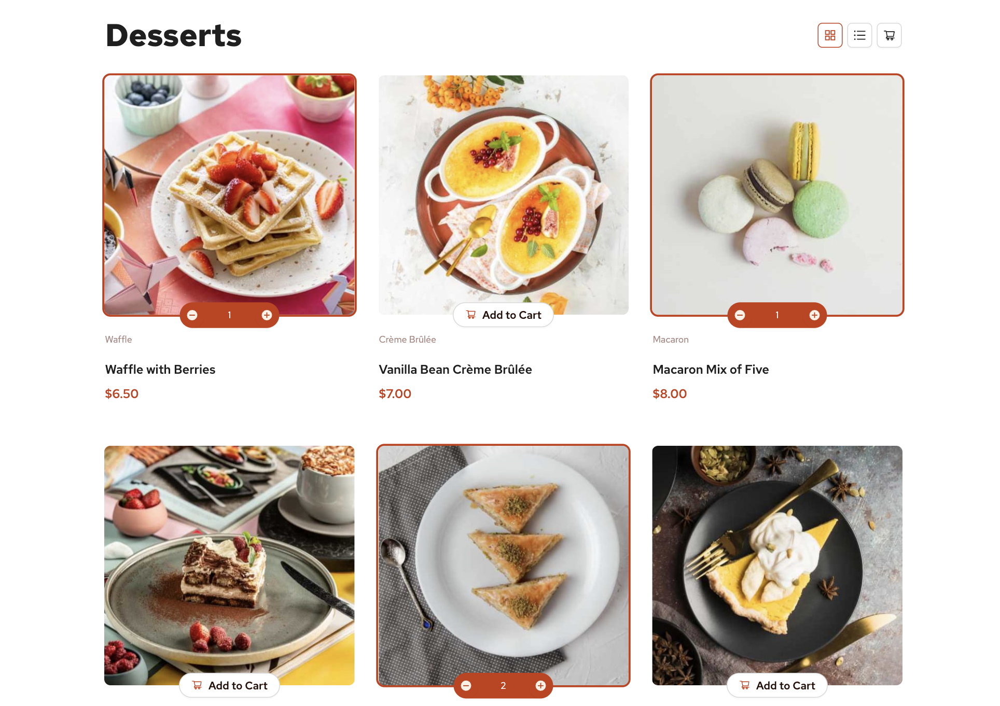
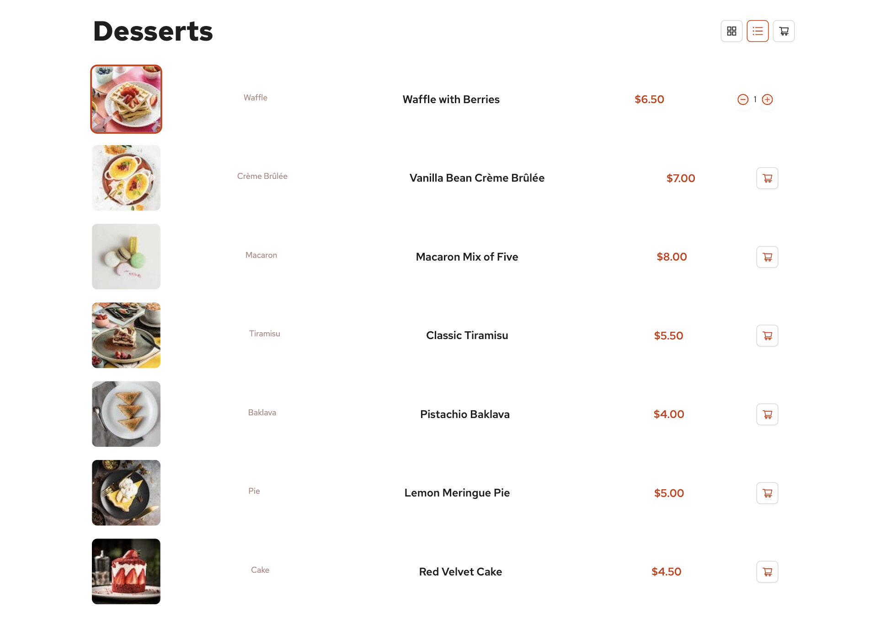
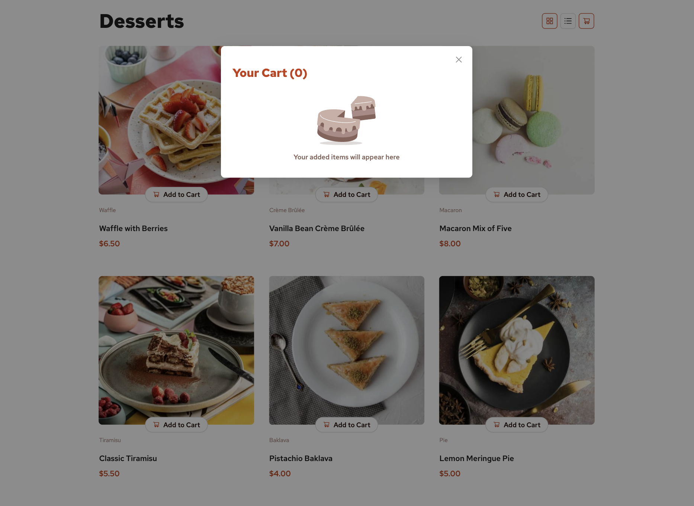
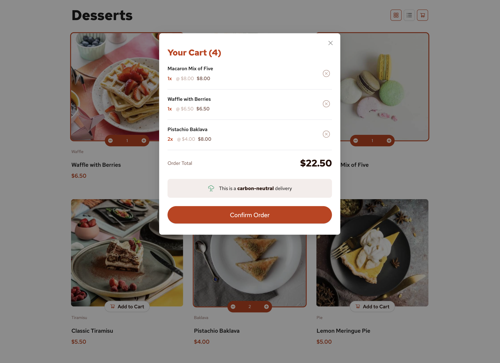
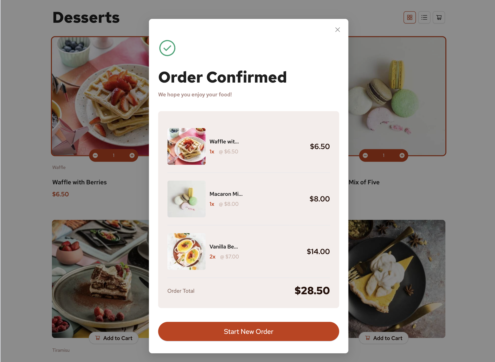
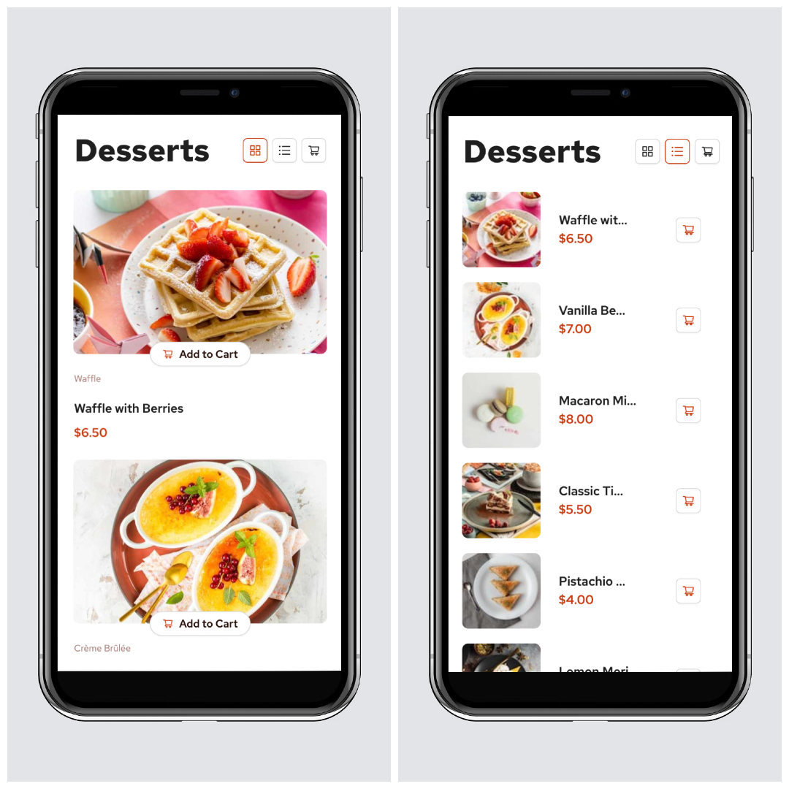
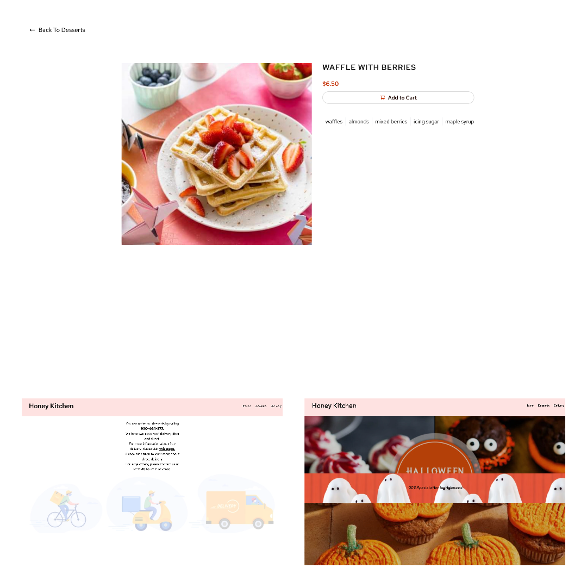
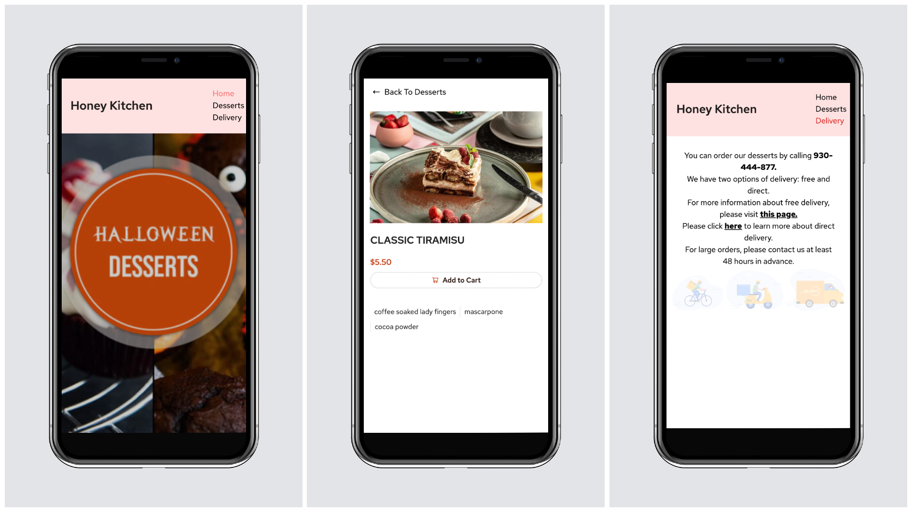

# Frontend Mentor - Product list with cart solution

This is a solution to the
[Product list with cart challenge on Frontend Mentor](https://www.frontendmentor.io/challenges/product-list-with-cart-5MmqLVAp_d).
Frontend Mentor challenges help you improve your coding skills by building
realistic projects.

## Table of contents

- [Overview](#overview)
  - [The challenge](#the-challenge)
  - [Screenshots for the main FM challenge](#screenshots-for-the-main-fm-challenge)
  - [Screenshots for additional tasks](#screenshots-for-additional-tasks)
  - [Links](#links)
- [My process](#my-process)
  - [Built with](#built-with)
  - [What I learned](#what-i-learned)
  - [Continued development](#continued-development)
  - [Useful resources](#useful-resources)
- [Author](#author)
- [Acknowledgments](#acknowledgments)

## Overview

### The challenge

Users should be able to:

- Add items to the cart and remove them
- Increase/decrease the number of items in the cart
- See an order confirmation modal when they click "Confirm Order"
- Reset their selections when they click "Start New Order"
- View the optimal layout for the interface depending on their device's screen
  size
- See hover and focus states for all interactive elements on the page

### Screenshots for the main FM challenge

### Screenshots for additional tasks

### Links

- Solution URL:
  [GitHub](https://github.com/svetikbaihe/product-list-with-cart.git)
- Live Site URL: [Vercel](https://product-list-with-cart-azure.vercel.app/)

## My process

### Built with

- HTML markup
- Typescript
- React
- React-Responsive
- React Router
- SCSS/SASS
- Tailwind
- Ant Design
- Flexbox
- Mobile-first workflow
- ESLint + Prettier
- Vite

### What I learned

First of all, I would like to talk about the new things I have learned
throughout this project. I used the Ant Design UI framework for the first time,
and I can say that it was not easy. As with any other new framework, library, or
feature, working efficiently with Ant Design requires time and patience. I am
100% sure that I missed something with the theme. Also, customizing components
was a great challenge as well.

This is my second React project, and I am still learning how to use it. In this
project, I incorporated different hooks such as useMemo, useCallback, and
useReducer alongside useContext and others.

I added some additional features that were not originally described in the
challenge. If you look at the screenshots, you can see that I added a 'list-grid
switcher', moved the cart and the empty cart component into separate modals, and
the design overall slightly differs from the original one. On top of that, I am
planning to expand this project a little by adding routing and some pages just
to practice react-router.

_Update_

As I mentioned before, I were going to practice React Router, and I did. I added
several pages to the initial project: Home, Dessert Details, Delivery(with two
subpages: Delivery Free and Delivery Direct). This was a big milestone for me as
a beginner in React. I learned how to navigate through a website and actively
used useMatches and custom hooks as well. As always, there is still a lot things
to learn and to do.

### Continued development

There is still a lot of work to be done with hooks, Ant Design concepts, and
React itself. Oh, and I still have some issues with ESLint. I must admit that
setting up the project from scratch is truly a distinct form of art.

### Useful resources

- [React](https://react.dev/) - Everyone who learns React should peruse this
  documentation.
- [React Router](https://reactrouter.com/en/main) - Tutorial which quickly
  introduces you to primary features of React router.
- [MockupBro](https://mockupbro.com/) - This is a great online mockup generator.
- [PIXLR](https://pixlr.com/) - Perfect free online photo editor for easy and
  quick collages.

## Author

- Frontend Mentor -
  [@svetikbaihe](https://www.frontendmentor.io/profile/svetikbaihe)

## Acknowledgments

- Kudos to my mentor - [@ArtemPapusha](https://github.com/ArtemPapusha)
